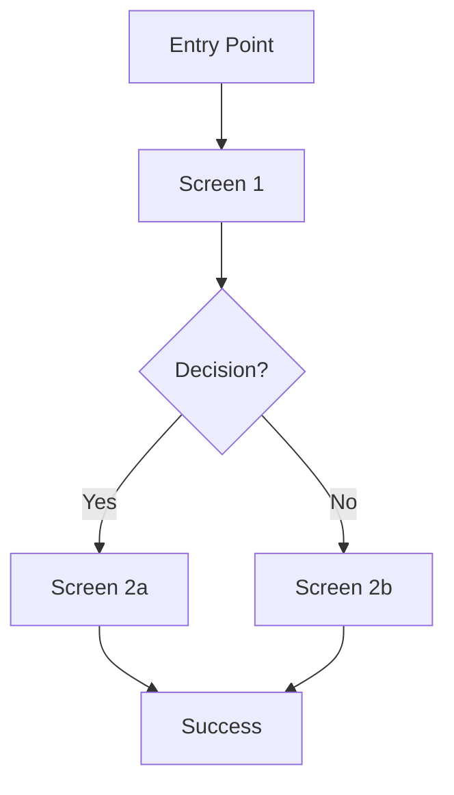

# User Flows

## Flow Format

Every user flow must follow this structure:

```
### Flow: [Flow Name]
**Related Feature**: F-XXX
**Related Stories**: US-XXX-XX, US-XXX-XX
**Persona**: [Which persona]
**Entry Point**: [How the user arrives at this flow]
**Goal**: [What the user is trying to accomplish]

#### Happy Path
1. [Screen Name] — User sees [what]. User does [action].
2. [Screen Name] — System responds with [response]. User sees [what].
3. ...
4. [Success Screen] — User sees confirmation of [goal achieved].

#### Error States
- **[Error condition]**: User sees [error screen/message]. Recovery: [how to recover].

#### Edge Cases
- **[Edge case]**: [What happens and how it's handled].
```

## Flow Diagram Convention (Mermaid)

When possible, include a mermaid diagram:



## Defined Flows

(Fill in as the project takes shape.)

### Flow 1: [Name]
(Use template above)
